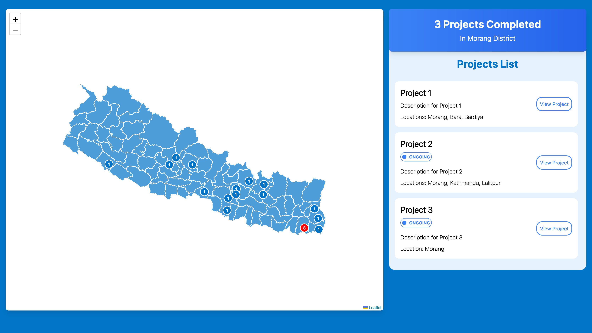

# Nepal Map Project Dashboard

## View the live demo at [https://nepal-districts-project-map.pages.dev/](https://nepal-districts-project-map.pages.dev/)

This is a custom dashboard which can be used to keep track of projects in districts across Nepal.

## Usage

- Clone the repository
- Run `npm install`
- Modify the `src/data/projects-data.json` and `src/data/marker-data.json` files as per your data requirements.
- Run via `npm run dev`, build with `npm run build`.
